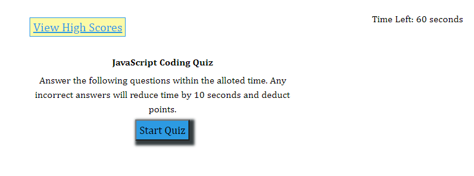

# JavaScript Code Quiz

The coding quiz tests you knowledge of five basic JavaScript coding rules. Any incorrect answers will reduce your time your score.

## Installation

## Usage

Follow the steps below to test your knowledge
1. Click on the [URL](https://hrkoren.github.io/codequiz) to open the site.
2. Read the quiz information, then click the Start button.
3. Answer each question as quickly as you can to increase your score.
4. When done, your score will be listed.
5. Enter you initials to save your score to the High Scores list.
6. Use the Clear High Scores button to clear all scores.

## License

This project is not licensed.